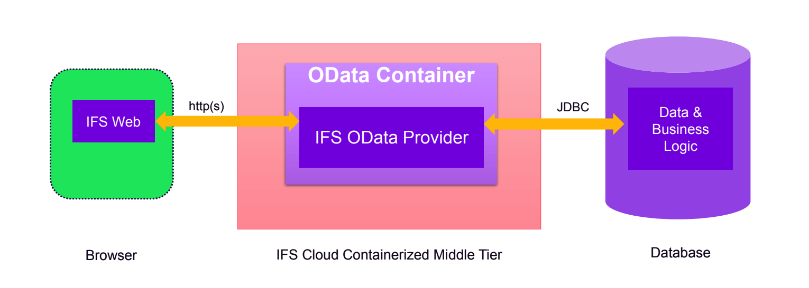

# IFS Architecture Notes

## What is IFS
- **IFS (Industrial and Financial Systems)** is an Enterprise Resource Planning (ERP) system.
- It helps organizations manage business operations such as:
  - Finance
  - Supply chain
  - Manufacturing
  - Human resources
  - Project management
- It integrates different business processes into a single platform.

## IFS Technical Architecture

IFS generally follows a **multi-layer architecture** that separates responsibilities across different layers.

### 1. Client Layer (User Interface)
- The layer where users interact with the system.
- Provides the **UI for accessing business applications**.
- Can include:
  - Web interface
  - Desktop client
  - Mobile applications
- Users perform actions such as:
  - Creating records
  - Viewing reports
  - Managing business data

### 2. Application Layer (Business Logic)
- Handles the **business logic and processing** of requests.
- Validates user input and applies business rules.
- Communicates with the database layer to retrieve or update data.
- Ensures that business operations follow defined rules and workflows.

### 3. Database Layer
- Stores all business data used by the system.
- IFS commonly uses **Oracle Database**.
- Developers interact with the database using:
  - **SQL** for querying and managing data
  - **PL/SQL** for implementing database logic such as procedures and triggers.

## Data Flow in IFS

Typical workflow in the system:

1. User performs an action in the **Client Layer**.
2. The request is processed in the **Application Layer**.
3. The application communicates with the **Database Layer**.
4. Data is retrieved or updated in the database.
5. The result is returned to the user through the client interface.

## Role of SQL and PL/SQL

- **SQL** is used to query and manipulate data in the database.
- **PL/SQL** is used to implement procedural logic inside the Oracle database.
- These are important for handling business data and database operations within the IFS system.