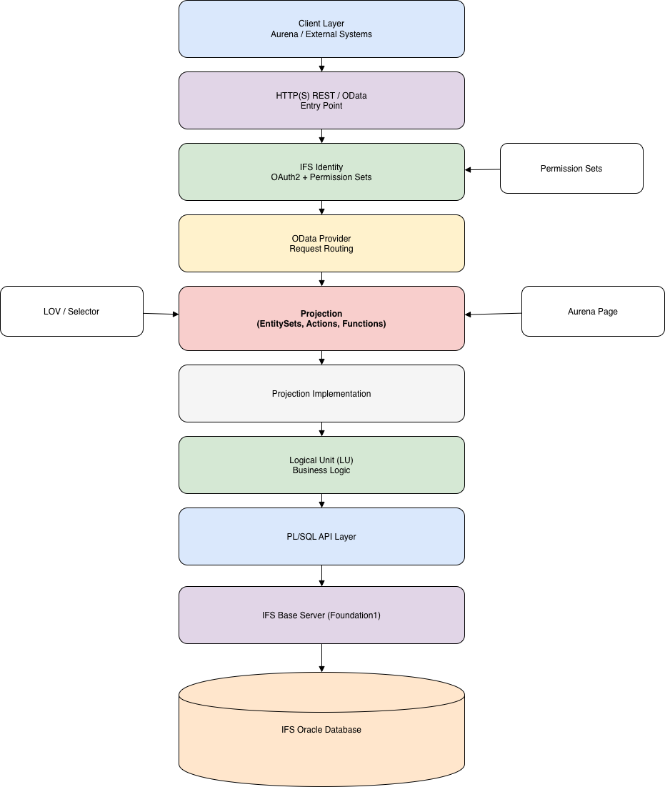

# Week 3 – Domain Workflow Processes

This week focuses on understanding IFS domain workflow concepts, integration architecture, and basic CI/CD pipeline concepts.

---

## 🏗 Integration Architecture Diagram

---

## Topics Covered

### IFS Concepts
- IFS Customization Concepts
- IFS APIs and Integrations
- Extension Framework
- Projection Concepts
- Entity Sets & Selectors
- List & Group Controls
- LoV Filtering
- Page Parameters

### DevOps Learning
- CI/CD pipeline basics
- Build pipeline concept

---

## 🚀 Deliverables

- Integration flow diagram (draw.io + image)
- Notes on IFS concepts and CI/CD

---

## 📌 Note

Aurena page creation was not included this week as per instructions.