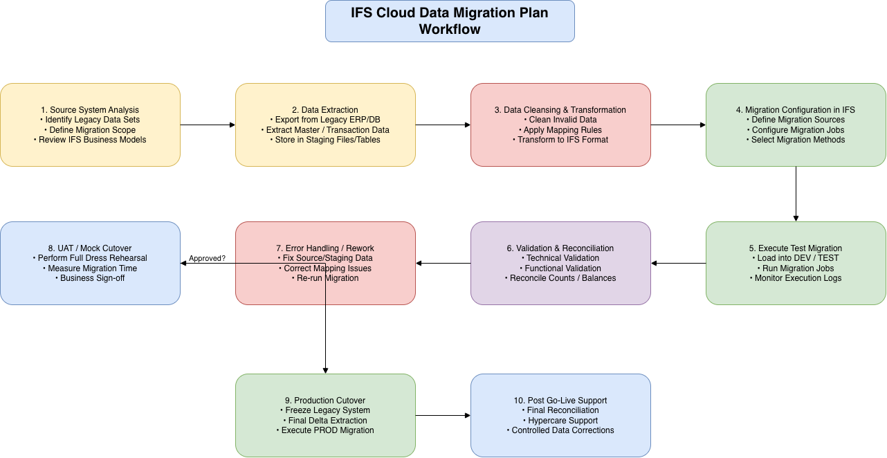

# Week 5 – Requirement Analysis

This week focuses on understanding data migration concepts, system data structures, integration patterns, and cloud fundamentals.

The goal is to design a structured **data migration approach** and document a complete migration plan.

---

## 📚 Topics Covered

 ### Technical Concepts
- Data Migration concepts
- Data structures (tables, relationships, keys)
- Integration patterns (API, file-based, event-driven)

### Cloud & DevOps Learning
- Introduction to Cloud platforms
- Azure fundamentals
- AWS basics
- Infrastructure overview (compute, storage, networking)

---

## 🚀 Task

Design a data migration approach for moving data from a source system to a target system (IFS/Database).

---

## 📄 Deliverable

- Data Migration Plan including:
  - Source and target systems
  - Data mapping
  - Migration steps
  - Validation strategy

---

## 🏗 Data Migration Workflow Diagram

The following diagram illustrates the IFS Cloud aligned end-to-end migration workflow, including staging, migration jobs, validation, and production cutover.

---

## 🎯 Objective

To understand how data is extracted, transformed, and loaded into a system while ensuring data integrity and consistency.

---

## 🧠 Key Focus Areas

- Understanding data flow between systems
- Designing structured migration steps
- Understanding cloud infrastructure basics
- Applying real-world system thinking

---

## 📌 Summary

This week emphasizes requirement analysis, system design, and cloud fundamentals. The focus is on planning, understanding architecture, and documenting a complete data migration process.
